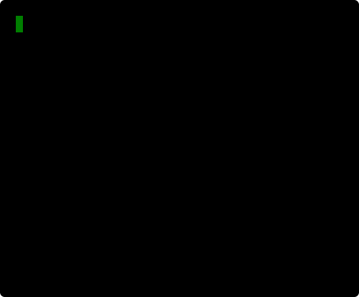

l0la is a sidecar cli utility to monitor vital stats of other processes on OSX at development
time. It combines the output of `lsof`, `ps` and `netstat`, then monitors these values
while active.

[](https://circleci.com/gh/simonmittag/l0la)
[](https://img.shields.io/github/commit-activity/m/simonmittag/mse6)  
[](https://img.shields.io/github/go-mod/go-version/simonmittag/l0la)
[](https://opensource.org/licenses/Apache-2.0)
[](https://github.com/simonmittag/mse6/releases/tag/v0.1.0)

## Up and running

### Homebrew
```
brew tap simonmittag/cli &&
  brew install l0la &&
  l0la 
```

## Usage
```
λ l0la -h
<l0la> v0.1.0
Usage: l0la [-v] [-h] [PID]
  -h    print help
  -v    print version
```

## Samples

Monitor a web server
```
pgrep j8a | xargs l0la
```



## Contributions
The l0la team welcomes all [contributors](https://github.com/simonmittag/mse6/blob/master/CONTRIBUTING.md). Everyone interacting with the project's codebase, issue trackers, chat rooms and mailing lists
is expected to follow the [code of conduct](https://github.com/simonmittag/mse6/blob/master/CODE_OF_CONDUCT.md)
